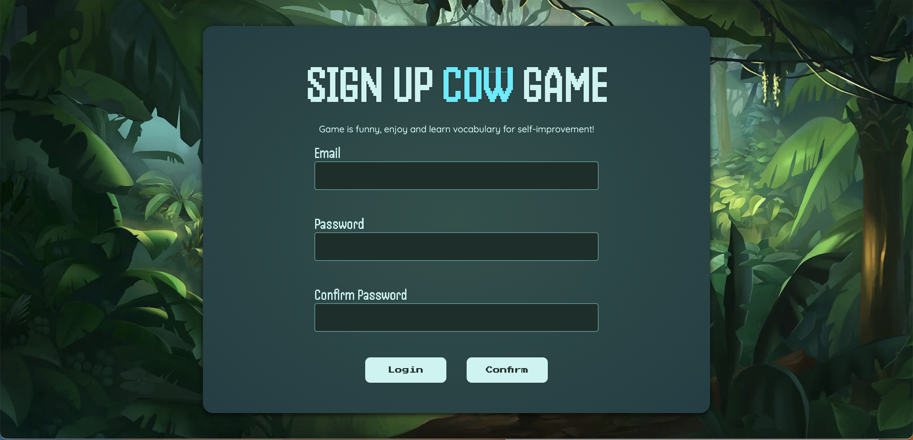
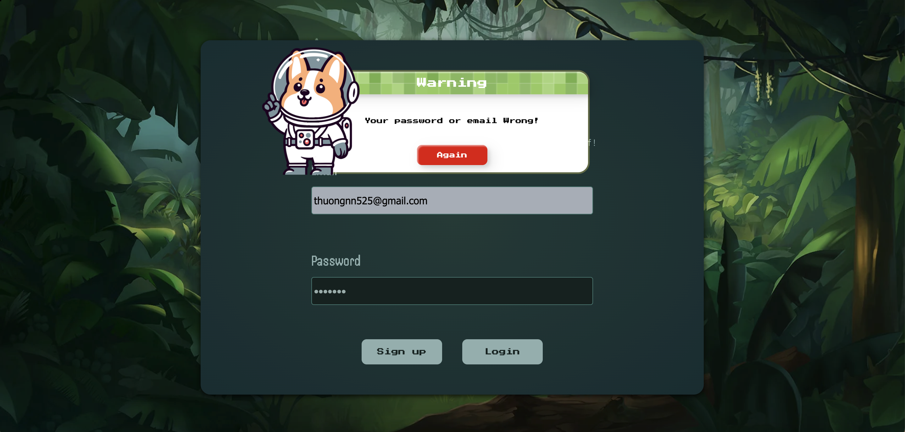
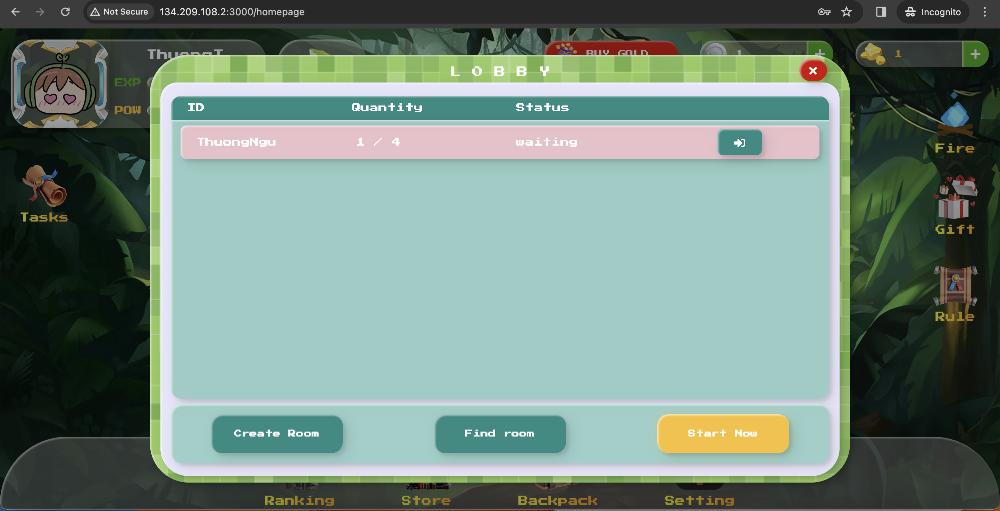
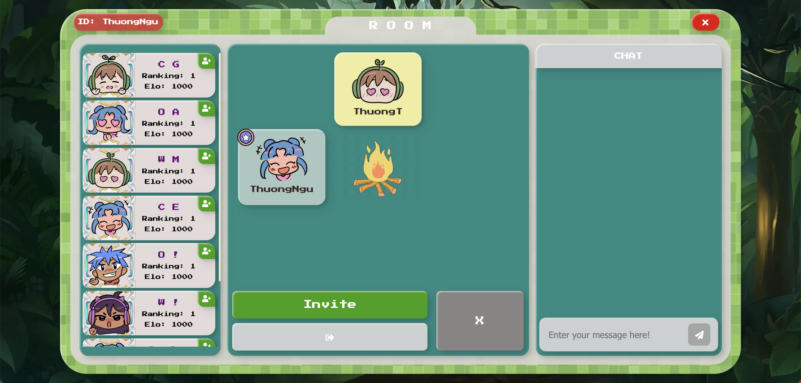
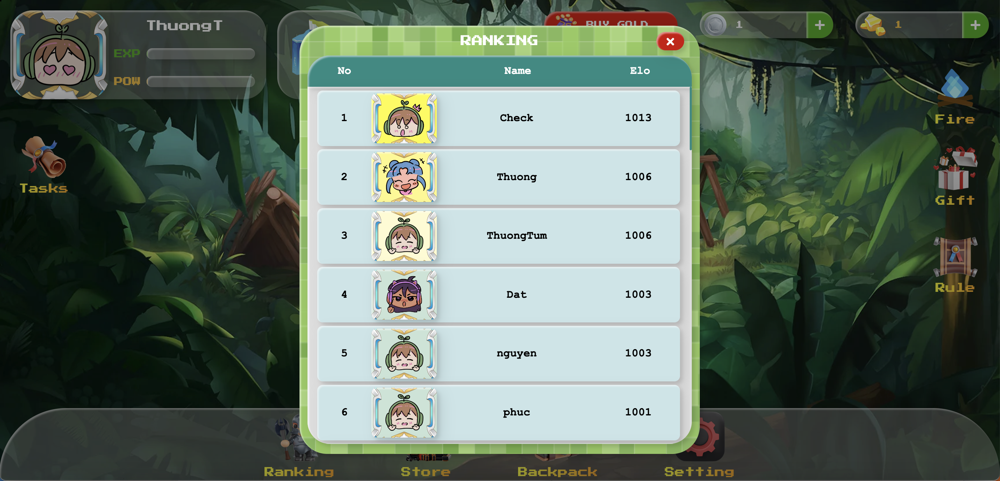
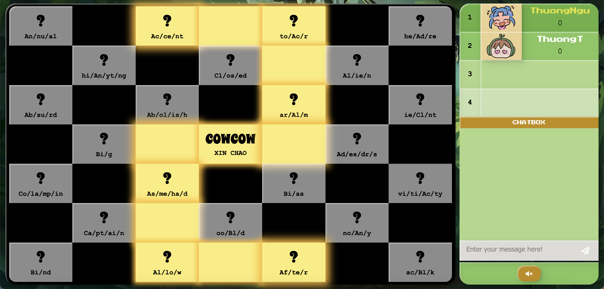
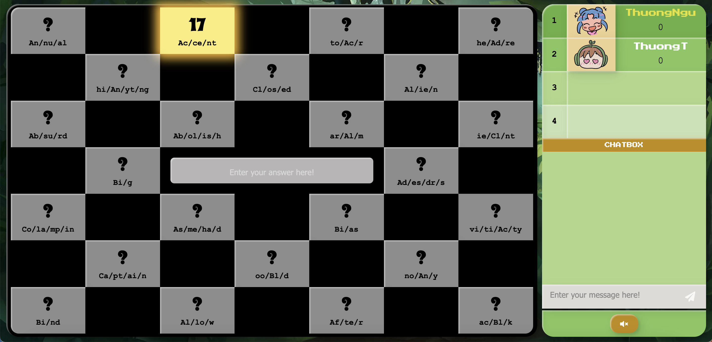

# GAME WEBSITE PROJECT - MSIS207.O12.CTTT

**Project:** Building a Game Website.
**Subject:** Web application development - **Class code:** MSIS207.O12.CTTT

## Members participating in the project:

| Full Name                    | StudentID        | Role         |
|-------------------------------|-----------------|-----------------|
| Nguyễn Nhất Thưởng           | 20522000        |     Leader, Front-end, Back-end |
| Phạm Thành Đạt                | 20521175        | Front-end, Back-end      |

>Tech stacks:

* Front-end: 
  - ReactJS
* Back-end: 
  - Nodejs
* Database: 
  - MongoDB

**1. Home Page Website**

